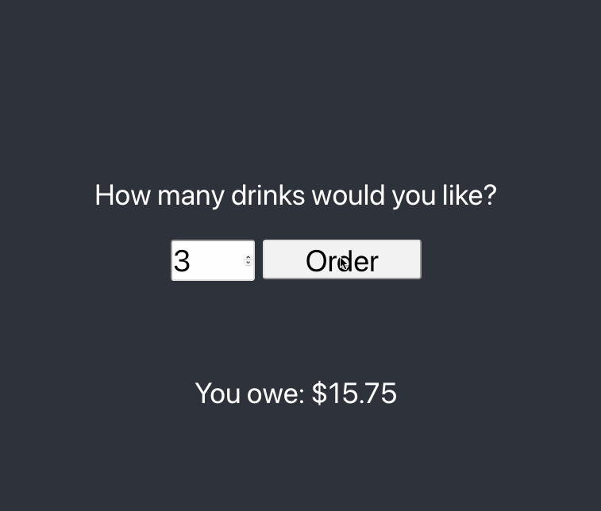

# React Redux Example App
This app demonstrates some basics for how to use `redux-act-classy` with a React + Redux project, including:
- Normal Synchronous Action
- Asynchronous Action
    - In progress state
    
Key Files:
- [drinks.state.ts](./src/drinks.state.ts) reducer and actions
- [App.tsx](./src/App.tsx) React component dispatching actions and using global redux state
- [index.tsx](./src/index.tsx) Redux store initialization

Here is a demo of the example app

